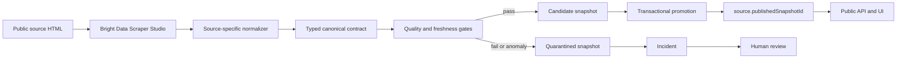

# CoolPath Live architecture

## Design goals

CoolPath has one trust boundary: untrusted collector output cannot become public data until it passes the complete canonical contract. Availability is secondary to provenance. When validation fails, the system prefers an explicitly historical trusted report or the verified public source page over a newer untrusted candidate.

## Components

| Area                       | Responsibility                                                                                            |
| -------------------------- | --------------------------------------------------------------------------------------------------------- |
| `packages/domain`          | Canonical data contract, validation, quality gates, transport classification and source-state transitions |
| `packages/source-adapters` | Scraper Studio boundary, real and mock clients, field-specific healing prompts and source normalizers     |
| `packages/db`              | SQLite WAL storage, Drizzle tables, candidate snapshots, transactional promotion and incidents            |
| `apps/api`                 | Allowlisted ingestion orchestration, published-only API, ETags and mock-only operator actions             |
| `apps/web`                 | Civic evidence ledger, source-state rendering, evidence drawer and recovery review UI                     |

## Publication flow

Only `source.publishedSnapshotId` is used for public reads. Candidate and quarantined rows remain internal. Promotion supersedes the prior snapshot and updates the pointer inside one SQLite transaction.

## Source state machine

| State            | Public behavior                                                              |
| ---------------- | ---------------------------------------------------------------------------- |
| `UNINITIALIZED`  | No list; source-page link only                                                |
| `CHECKING`       | Keep any last trusted report protected during the check                      |
| `HEALTHY`        | Show current verified data from the published snapshot                       |
| `DEGRADED`       | Show the last trusted report while it remains within TTL                     |
| `STALE`          | Mark the last trusted report historical and remove current wording           |
| `BROKEN`         | Never publish the failed candidate; retain a last trusted snapshot if present |
| `HEALING`        | Keep the trusted report protected while a repair is prepared                 |
| `REVIEW_PENDING` | Display the preview; do not apply changes automatically                      |
| `RECOVERED`      | Show the newly validated and published recovery snapshot                     |

Transport failures are inconclusive. A 403, 429, timeout, DNS failure or temporary provider failure does not prove layout drift.

## Self-healing sequence

1. A baseline collector run passes and publishes a trusted snapshot.
2. The same source URL changes from layout v1 to v2.
3. The collector returns malformed or incomplete output.
4. Contract checks quarantine the candidate and open an incident.
5. The published pointer remains unchanged.
6. A field-specific prompt is sent to the Bright Data self-healing endpoint.
7. The asynchronous preview is polled until manual review is possible.
8. The UI displays selector changes per field.
9. An operator approves or rejects the preview.
10. On approval, the same Collector ID is re-run.
11. The complete contract suite runs again.
12. Only a passing recovered candidate is published and linked to the incident.

The mock adapter implements the same boundary and labels its output `mock`. It never presents staged work as a real provider run.

## Data model

- `City`: public name, slug, region and IANA timezone.
- `Source`: canonical source URL, origin allowlist, collector identity, TTL, policy version and published snapshot pointer.
- `IngestRun`: bounded provider and validation facts, hashes and reason codes.
- `Snapshot`: immutable site records with candidate, quarantined, published or superseded status.
- `Incident`: the failed run, reason codes, healing review state and recovery link.
- `TimelineEvent`: bounded human-readable operational evidence for the demo and technical view.

SQLite uses WAL mode and foreign-key enforcement. The repository API is deliberately narrow so a managed Postgres implementation can replace it without changing domain logic.

## Frontend routing and source selection

The two frontend views are URL-backed: the public directory is the default and the presenter view uses `?view=technical`. The web client discovers `/api/cities`, honors an optional `VITE_CITY_SLUG`, otherwise prefers a real-mode source and then falls back to the first configured city. This keeps the Pennsylvania 211 `philadelphia` source and the deterministic `demo-city` fixture on the same API contract without hardcoding either into the interface.

## Security and privacy

- Source IDs and origins come from configuration, never request input.
- Evidence URLs are HTTPS-only and checked against per-source origin allowlists.
- Redirects from the Bright Data API client are rejected.
- Raw HTML is never part of public responses.
- React renders evidence as text, not `innerHTML`.
- API errors are sanitized; server logs redact authorization and token fields.
- CSP, Helmet headers and explicit CORS origin are enabled.
- SQL statements are parameterized through Drizzle and `better-sqlite3`.
- No accounts, geolocation, analytics, client-IP persistence or personal contact data.

## Operational limitations

- A real Pennsylvania 211 Collector ID and Bright Data API token are intentionally not stored in the repository.
- Deployment configuration is environment-specific and is not included until a target platform is selected.
- The deterministic fixture demonstrates layout drift at one synthetic URL; it is not Pennsylvania 211 or municipal source data.
- The current Bright Data client triggers a batch, polls `/dca/dataset` and accepts the documented final JSON array. Confirm the configured collector's field names during the manual live smoke check.
