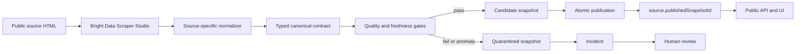

# CoolPath Live architecture

## Design goals

CoolPath has one trust boundary: untrusted collector output cannot become public data until it passes the complete canonical contract. Availability is secondary to provenance. When validation fails, the system prefers an explicitly historical trusted report or the verified public source page over a newer untrusted candidate.

## Components

| Area                       | Responsibility                                                                                                                    |
| -------------------------- | --------------------------------------------------------------------------------------------------------------------------------- |
| `packages/domain`          | Canonical data contract, validation, coverage accounting, transport classification, freshness checks and source-state transitions |
| `packages/source-adapters` | Scraper Studio boundary, real and mock clients, complete-operation timeouts, field-specific healing prompts and normalizers       |
| `packages/db`              | SQLite WAL storage, authoritative SQL migrations, candidate snapshots, atomic publication, incidents and bounded timelines        |
| `apps/api`                 | Allowlisted ingestion, per-source coordination, freshness reconciliation, semantic caching, probes and operator actions           |
| `apps/web`                 | Civic evidence ledger, source-state rendering, evidence drawer and recovery review UI                                             |

## Publication flow

Only `source.publishedSnapshotId` is used for public reads. Candidate and quarantined rows remain internal. A passing publication supersedes the prior snapshot, updates the public pointer, restores source state, resolves any active incident with the proving run, and records its timeline event inside one SQLite transaction.

An ordinary passing check after an incident records `HEALTHY` and an ordinary-recovery timeline event. A passing rerun after an approved healing workflow records `RECOVERED`. A quarantined, review-required or inconclusive run cannot resolve the incident.

## Source state machine

| State            | Public behavior                                                               |
| ---------------- | ----------------------------------------------------------------------------- |
| `UNINITIALIZED`  | No list; source-page link only                                                |
| `CHECKING`       | Keep any last trusted report protected during the check                       |
| `HEALTHY`        | Show current verified data from the published snapshot                        |
| `DEGRADED`       | Show the last trusted report while it remains within TTL                      |
| `STALE`          | Mark the last trusted report historical and remove current wording            |
| `BROKEN`         | Never publish the failed candidate; retain a last trusted snapshot if present |
| `HEALING`        | Keep the trusted report protected while a repair is prepared                  |
| `REVIEW_PENDING` | Display the preview; do not apply changes automatically                       |
| `RECOVERED`      | Show the newly validated and published recovery snapshot                      |

Transport failures are inconclusive. A 403, 429, timeout, DNS failure or temporary provider failure does not prove layout drift.

## Truthful freshness

The published snapshot remains immutable historical evidence, but its source state is reconciled against `observedAt` and `freshnessTtlMinutes` whenever public city data is read and when the application initializes.

- An in-TTL snapshot leaves source state unchanged.
- An expired snapshot transitions to `STALE` and adds one freshness-expired timeline event.
- Repeated reads are idempotent and do not write duplicate events.
- Reconciliation never calls Bright Data.
- The trusted snapshot is not deleted or silently replaced.
- A later passing ingestion publishes a replacement and returns the source to `HEALTHY` or `RECOVERED` according to the recovery path.

This makes freshness a property of the running representation rather than a transition that happens only after the next provider attempt.

## Startup, readiness and shutdown

Source configuration is seeded synchronously and idempotently before `buildApp` returns. Mock mode deterministically creates its initial fixture when no trusted snapshot exists.

Real mode is credit-safe by default. With `AUTO_START_REAL_CHECK=false`, the API starts without a collection attempt. An operator or scheduler intentionally invokes the authenticated source check. With `AUTO_START_REAL_CHECK=true`, one initial check may run in a caught background task only when the database has no trusted snapshot. The HTTP listener and `/healthz` do not wait for the provider.

- `GET /healthz` is a lightweight process-liveness signal.
- `GET /readyz` checks database usability, source initialization and trusted-snapshot availability.
- Provider availability is not a readiness dependency once a trusted snapshot exists.
- Background failures are recorded through normal run/state logic, safely logged and cannot become unhandled promise rejections.
- Existing snapshots are immediately readable during a provider outage.

`SIGINT` and `SIGTERM` call Fastify `close()`. Internally owned scraper clients are closed first so active Bright Data operations abort through their normal timeout path; the caught background task completes before the internally owned repository closes. Externally injected repositories and clients remain owned by their test or embedding caller and are not double-closed.

## Per-source operation coordination

A small in-process coordinator provides a single-flight boundary keyed by allowlisted source ID.

- A source cannot run two checks concurrently.
- Check, healing-preview and healing-decision mutations cannot overlap for the same source.
- A conflicting authenticated request receives a sanitized HTTP `409`.
- Separate source IDs remain independent.
- `finally` releases coordination after success, timeout, provider failure, quarantine, persistence failure or any thrown exception.
- Authentication runs before mutation code, so unauthorized requests neither acquire nor inspect operation state.

This boundary protects Bright Data credits and prevents races around source state without introducing a distributed-lock dependency that the current single-process SQLite deployment does not need.

## Self-healing sequence

1. A baseline collector run passes and publishes a trusted snapshot.
2. The same source URL changes from layout v1 to v2.
3. The collector returns malformed or incomplete output.
4. Contract checks quarantine the candidate and open an incident.
5. The published pointer remains unchanged.
6. A field-specific prompt is sent to the Bright Data self-healing endpoint.
7. The asynchronous preview is polled until manual review is possible.
8. The UI displays selector changes per field.
9. An operator approves or rejects the preview.
10. On approval, the same Collector ID is re-run.
11. The complete contract suite runs again.
12. Only a passing recovered candidate is atomically published and linked to the incident.

The mock adapter implements the same boundary and labels its output `mock`. It never presents staged work as a real provider run.

## Provider timeout boundary

Every Bright Data operation owns one `AbortController` and one deadline covering:

- trigger dispatch and trigger response-body parsing;
- collection polling and polling sleeps;
- dataset response-body parsing, including stalled streams;
- healing request, progress polling and response-body parsing;
- approval dispatch.

The abort promise races the complete asynchronous operation, not only `fetch()` dispatch. Timers and abort listeners are cleaned up after success, timeout or shutdown. Redirects remain rejected with `redirect: "error"`.

## HTTP representation caching

Public endpoints hash the meaningful response data rather than only `snapshot.contentHash`. City-detail ETags include:

- city and source metadata;
- source state;
- published snapshot content and identity;
- latest run and aggregate coverage metrics;
- active incident state;
- the bounded timeline.

The volatile envelope `generatedAt` timestamp is excluded from the semantic hash. Identical data therefore keeps a stable ETag, while drift, freshness expiry, incident review and recovery invalidate it. Public reads use `Cache-Control: public, max-age=0, must-revalidate` and support `If-None-Match` with `304`. Mutations, probes, authentication failures and errors use `no-store` where applicable.

## Data model

- `City`: public name, slug, region and IANA timezone.
- `Source`: canonical source URL, origin allowlist, collector identity, TTL, policy version and published snapshot pointer.
- `IngestRun`: bounded provider and validation facts, hashes, aggregate coverage and reason codes.
- `Snapshot`: immutable site records with candidate, quarantined, published or superseded status.
- `Incident`: the failed run, reason codes, healing review state and recovery link.
- `TimelineEvent`: bounded human-readable operational evidence for the demo and technical view.

Timeline reads default to 50 newest events and reject payload growth above a hard limit of 100 events per response.

## Persistence and migrations

SQLite remains the intentional persistence boundary for the bounded deployment. WAL mode and foreign-key enforcement are enabled for every repository instance.

`packages/db/migrations/*.sql` is the only authoritative schema definition. Repository initialization creates `_coolpath_migrations` and applies unapplied numbered migrations transactionally in lexical order. The initial migration uses idempotent table and index creation so a database created by the earlier inline-schema implementation can be adopted without deleting existing rows. Initializing the same database twice is safe.

Future schema changes require a new numbered migration. Applied migration files must not be rewritten in deployed environments. The migration directory must ship alongside the compiled package because the runtime migrator resolves it directly from the package location.

## Source-coverage evidence

The PA 211 normalizer returns canonical records plus aggregate accounting. The validation summary persists and may expose only these bounded counts:

- provider records received;
- normalized records accepted;
- parsed rows filtered because they are not locations;
- exact duplicates removed;
- rows rejected by source or canonical validation;
- accepted canonical sites quarantined because the candidate did not pass publication gates.

Raw rejected rows and private provider response data are never persisted in the summary or returned by the API. Detailed counting semantics and the bounded 25-of-32 source limitation are documented in [source-policy.md](source-policy.md).

## Structured observability

Every completed ingestion emits one structured log with safe fields only: `sourceId`, `runId`, duration, disposition, normalized record count and reason codes. Normalizer failures log the source ID, error class and provider row count, not the raw rejected record. Logger redaction covers authorization and token-bearing fields.

## Frontend routing and source selection

The two frontend views are URL-backed: the public directory is the default and the presenter view uses `?view=technical`. The web client discovers `/api/cities`, honors an optional `VITE_CITY_SLUG`, otherwise prefers a real-mode source and then falls back to the first configured city. This keeps the Pennsylvania 211 `philadelphia` source and the deterministic `demo-city` fixture on the same API contract without hardcoding either into the interface.

## Security and privacy

- Source IDs and origins come from configuration, never request input.
- Evidence URLs are HTTPS-only and checked against per-source origin allowlists.
- Redirects from the Bright Data API client are rejected.
- Raw HTML and rejected provider records are never part of public responses.
- React renders evidence as text, not `innerHTML`.
- API errors are sanitized; server logs redact authorization and token fields.
- Bearer tokens are compared in constant time after an exact-length check.
- CSP, Helmet headers and explicit CORS origin are enabled.
- SQL statements are parameterized through Drizzle and `better-sqlite3`.
- No accounts, geolocation, analytics, client-IP persistence or personal contact data.

## Operational limitations

- A real Pennsylvania 211 Collector ID, Bright Data API token and operator token are intentionally not stored in the repository.
- `AUTO_START_REAL_CHECK` must be enabled deliberately; the default avoids unexpected Bright Data credit use.
- The per-source coordinator is process-local. A multi-replica deployment would require an external coordination design before enabling mutations on more than one replica.
- Deployment configuration is environment-specific and is not included until a target platform is selected.
- The deterministic fixture demonstrates layout drift at one synthetic URL; it is not Pennsylvania 211 or municipal source data.
- The bounded Pennsylvania 211 first page is not complete source coverage and the application does not attempt undocumented pagination.
- The current Bright Data client triggers a batch, polls `/dca/dataset` and accepts final JSON arrays or JSON Lines. Confirm the configured collector's field names during the manual live smoke check.
